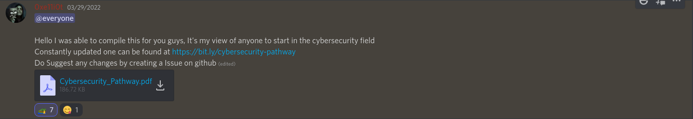

# Cats and Codes

**Category:** OSINT

Our admin @e11i0t posted a new guide for cybersecurity career and something seems fishy there go find it

flag format: CTF{xxx}

**Author:** `0xe11i0t#2534`

**Flag:** `CTF{xD_l0st_1n_t1m3}`

Around the time the challenge was released, 0xe11i0t had made an announcement on the [ISFCR Discord server](https://discord.com/invite/3m4XaEe6hS). You can find it [here](https://discord.com/channels/621232442086260737/621665205142814740/958420485161484309).

If we take a look at the commit history of the repository that was [linked](https://github.com/Mre11i0t/Introduction-to-Cybersecurity), we can find one that says "I am Lost In Time". Perhaps, it has something do with the flag we're trying to find.

We can take a look at the changed files for that commit and find the flag.
